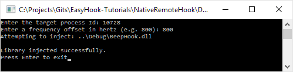
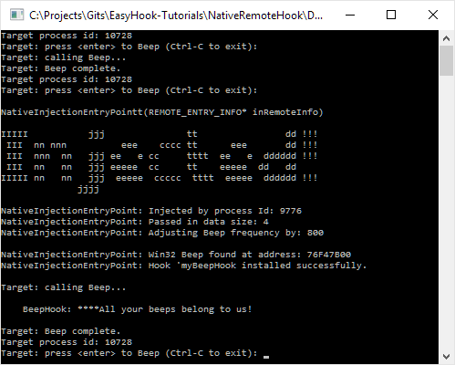

<h2>Installing a remote hook using EasyHook with C++</h2>
In this tutorial we will use a hook similar to what we created in [Using EasyHook with C++](nativehook.html), and inject it into another process. We will also pass through the desired frequency offset entered by the user and use this in the `myBeepHook` hook within the target application.

In this tutorial we will create 3 projects within the same solution:

 1. A console app "Target" that will be used as the target of our hook. This will simply call the Win32 Beep function whenever the [enter] key is pressed.
 2. A console app "Injector" that will act as the injector of "BeepHook.dll" into the target application "Target.exe". This application contains our injection logic, including asking the user for the process Id of the target application, and the frequency to be added to the `Beep` call within the hook.
 3. A native DLL "BeepHook.dll" that we will inject into the target console app "Target.exe" above, this will contain our hooking logic and the necessary export to support EasyHook injection.



The full NativeRemoteHook tutorial source project can be [found here](https://github.com/EasyHook/EasyHook-Tutorials/tree/master/Native/NativeRemoteHook).

<h3>The target application</h3>

We will begin by creating a new **Win32 Console Application** project called "Target". This app will output the current process Id, and then await user input before calling the Win32 Beep function.


#include <iostream>
#include <string>
#include <Windows.h>

int _tmain(int argc, _TCHAR* argv[])
{
	std::string value;
	while (true)
	{
		// Output the current process Id
        HANDLE currentThread = GetCurrentThread();
		std::cout << "Target.exe process id: ";
		std::cout << GetProcessIdOfThread(currentThread);
		std::cout << "\n";
		CloseHandle(currentThread);
        
        std::cout << "Press <enter> to Beep (Ctrl-C to exit): ";
		std::getline(std::cin, value);
		Beep(500, 500);
	}
	return 0;
}


<h3>The injector application</h3>

The injector is a new **Win32 Console Application** project called "Injector". This is often also referred to as the host application and will be responsible for injecting a DLL into the target application.

This app will ask for the target process Id, then the frequency by which we want to change the sound of calls to `Beep` within the target process. These are then passed into a call to EasyHook's `RhInjectLibrary` function along with the location of the 32-bit DLL to be injected. 

If targeting 64-bit applications it would be necessary to provide a 64-bit DLL to be injected. **Note:** unlike the managed EasyHook library the native injection method does not support crossing the Wow64 boundary, therefore your injector app and injection DLL must be compiled for 32-bit and/or 64-bit as required.

*Depending on how you configure the outputs of your projects, you may need to adjust the path to "BeepHook.dll". Just remember that the process' current directory will be different when running within the Visual Studio debugger as compared to when it is run directly from Windows Explorer or the Command Prompt.*


#include <iostream>
#include <string>
#include <cstring>

#include <easyhook.h>

int _tmain(int argc, _TCHAR* argv[])
{
	DWORD processId;
	std::wcout << "Enter the target process Id: ";
	std::cin >> processId;

	DWORD freqOffset = 0;
	std::cout << "Enter a frequency offset in hertz (e.g. 800): ";
	std::cin >> freqOffset;

	WCHAR* dllToInject = L"..\\Debug\\BeepHook.dll";
	wprintf(L"Attempting to inject: %s\n\n", dllToInject);

	// Inject dllToInject into the target process Id, passing 
	// freqOffset as the pass through data.
	NTSTATUS nt = RhInjectLibrary(
		processId,   // The process to inject into
		0,           // ThreadId to wake up upon injection
		EASYHOOK_INJECT_DEFAULT,
		dllToInject, // 32-bit
		NULL,		 // 64-bit not provided
		&freqOffset, // data to send to injected DLL entry point
		sizeof(DWORD)// size of data to send
	);

	if (nt != 0)
	{
		printf("RhInjectLibrary failed with error code = %d\n", nt);
		PWCHAR err = RtlGetLastErrorString();
		std::wcout << err << "\n";
	}
	else 
	{
		std::wcout << L"Library injected successfully.\n";
	}

	std::wcout << "Press Enter to exit";
	std::wstring input;
	std::getline(std::wcin, input);
	std::getline(std::wcin, input);
	return 0;
}


<h3>The hook DLL</h3>

The hook DLL is a new **Win32 Project** called "BeepHook", select "DLL" as the Application type within the new project wizard. This project will not only contain the hook logic, but also the entry point that EasyHook requires to support injecting the native DLL.

Install the **EasyHook Native Package** from NuGet (you will see more than one package if you search for EasyHook, you are after the "EasyHook **Native** Package"). Alternatively you can download the binary package from the EasyHook GitHub repository and manually reference the EasyHook library and "easyhook.h".

We will create the `myBeepHook` function as defined within "[Using EasyHook with C++](nativehook.html)", except that this time we will allow the frequency to be configured using a global frequency offset that has been provided by the injector application.

For remote native/unmanaged hooks, EasyHook is expecting to find an export named `NativeInjectionEntryPoint` within your DLL. EasyHook will call this method once the DLL has successfully been injected. This is also where we will install our `myBeepHook` hook function. 

Our hook will be installed in almost the exact same way as shown previously aside from one important change, we will be setting up the thread ACL to include ALL threads EXCEPT the injector thread. This means that all threads that call `Beep` will call our hook function except the thread that called `NativeInjectionEntryPoint` (i.e. the injection thread). 

Another difference in this tutorial is that we will not be uninstalling the hook. Instead we will leave it running until the target process exits.


#include <easyhook.h>
#include <string>
#include <iostream>
#include <Windows.h>

DWORD gFreqOffset = 0;
BOOL WINAPI myBeepHook(DWORD dwFreq, DWORD dwDuration)
{
	std::cout << "\n    BeepHook: ****All your beeps belong to us!\n\n";
	return Beep(dwFreq + gFreqOffset, dwDuration);
}

// EasyHook will be looking for this export to support DLL injection. If not found then 
// DLL injection will fail.
extern "C" void __declspec(dllexport) __stdcall NativeInjectionEntryPoint(REMOTE_ENTRY_INFO* inRemoteInfo);

void __stdcall NativeInjectionEntryPoint(REMOTE_ENTRY_INFO* inRemoteInfo)
{
	std::cout << "\n\nNativeInjectionEntryPointt(REMOTE_ENTRY_INFO* inRemoteInfo)\n\n" <<
		"IIIII           jjj               tt                dd !!! \n"
		" III  nn nnn          eee    cccc tt      eee       dd !!! \n"
		" III  nnn  nn   jjj ee   e cc     tttt  ee   e  dddddd !!! \n"
		" III  nn   nn   jjj eeeee  cc     tt    eeeee  dd   dd     \n"
		"IIIII nn   nn   jjj  eeeee  ccccc  tttt  eeeee  dddddd !!! \n"
		"              jjjj                                         \n\n";

	std::cout << "Injected by process Id: " << inRemoteInfo->HostPID << "\n";
	std::cout << "Passed in data size: " << inRemoteInfo->UserDataSize << "\n";
	if (inRemoteInfo->UserDataSize == sizeof(DWORD))
	{
		gFreqOffset = *reinterpret_cast<DWORD *>(inRemoteInfo->UserData);
		std::cout << "Adjusting Beep frequency by: " << gFreqOffset << "\n";
	}

	// Perform hooking
	HOOK_TRACE_INFO hHook = { NULL }; // keep track of our hook

	std::cout << "\n";
	std::cout << "Win32 Beep found at address: " << GetProcAddress(GetModuleHandle(TEXT("kernel32")), "Beep") << "\n";

	// Install the hook
	NTSTATUS result = LhInstallHook(
		GetProcAddress(GetModuleHandle(TEXT("kernel32")), "Beep"),
		myBeepHook,
		NULL,
		&hHook);
	if (FAILED(result))
	{
		std::wstring s(RtlGetLastErrorString());
		std::wcout << "Failed to install hook: ";
		std::wcout << s;
	}
	else 
	{
		std::cout << "Hook 'myBeepHook installed successfully.";
	}

	// If the threadId in the ACL is set to 0,
	// then internally EasyHook uses GetCurrentThreadId()
	ULONG ACLEntries[1] = { 0 };

	// Disable the hook for the provided threadIds, enable for all others
	LhSetExclusiveACL(ACLEntries, 1, &hHook);

	return;
}


<h3>Running the example</h3>

To run the example scenario follow these steps:

 1. Ensure all projects have been built for 32-bit.
 2. Start up Target.exe (either in the debugger or directly) - note that it outputs the process Id to be used.
    1. Press enter to hear the beep.
 3. Start Injector.exe
    1. Enter the process Id for Target.exe
    2. Enter a frequency to change the beeps by, e.g. 800
    3. If all is well you should see a message indicated that the library was successfully injected.
    4. Otherwise you will see EasyHook's reason why it failed (e.g. could not find the DLL or process not found etc...).
 4. Back within the Target.exe console app you should see some text output by the injected DLL
 5. Pressing enter should now play the beep using a frequency offset by the value passed in.

Included below is some example output from each application.

The Injector application: 

The Target application: 
