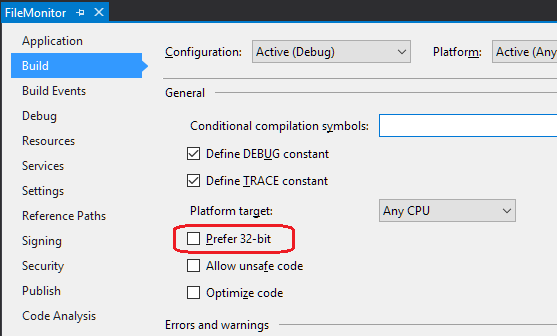
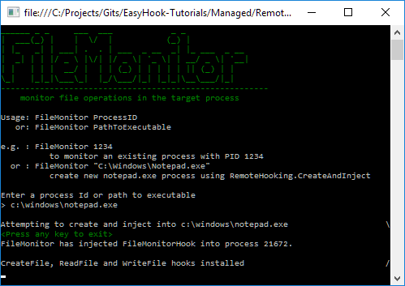
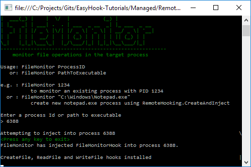
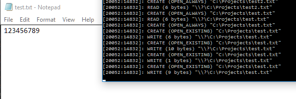

<h2>Creating a remote file monitor</h2>
In this tutorial we will create a remote file monitor using EasyHook. We will cover how to:


 1. Inject a managed assembly into an existing target process based on the process Id
 1. Inject a managed assembly into a newly created (and suspended) process using path to executable
 1. Create local hooks within the remote process to monitor 3 file operations (CreateFile, ReadFile and WriteFile)
 1. Report file accesses back to the main console application using .NET inter-process communication (IPC)

For this tutorial we will be creating a solution with two projects: 
 
 * <strong>FileMonitor</strong>: a C# console application; and
 * <strong>FileMonitorHook</strong>: a C# class library that contains the hook logic and the IPC interface. This assembly is our injection payload.
 
The full source for the remote file monitor project can be [found here](https://github.com/EasyHook/EasyHook-Tutorials/tree/master/Managed/RemoteFileMonitor).

<h3>Tutorial contents</h3>
 1. [Remote hooking overview](#overview)
 1. [Step 1: Create the injection payload: FileMonitorHook class library](#step1)
    1. [ServerInterface class](#serverinterface)
    1. [InjectionEntryPoint class](#injectionentrypoint)
 1. [Step 2: Create the FileMonitor console app](#step2)
 1. [Example output](#output)

 
 
<h3>Remote hooking overview</h3>
Remote hooking generally involves first injecting a payload from the "injector" into the target process and then from this payload, installing the hooks.

For this purpose, the EasyHook library provides the [`EasyHook.RemoteHooking`](/api/html/T_EasyHook_RemoteHooking.htm) static class and the [`EasyHook.IEntryPoint`](/api/html/T_EasyHook_IEntryPoint.htm) interface. 

Hooks will still be created using the `EasyHook.LocalHook` class from within the payload (see [Creating a local hook](./createlocalhook.html)).

 1. [`EasyHook.RemoteHooking.Inject`](/api/html/M_EasyHook_RemoteHooking_Inject_1.htm): injects the specified 32-bit/64-bit library into the process identified by the provided process Id. Parameters can be provided that are passed into the injected library.
 1. [`EasyHook.RemoteHooking.CreateAndInject`](/api/html/M_EasyHook_RemoteHooking_CreateAndInject.htm): creates a new process in a suspended state from the provided executable path and command line, and then injects the specified 32-bit/64-bit library as per `Inject`.
 1. [`EasyHook.RemoteHooking.WakeUpProcess`](/api/html/M_EasyHook_RemoteHooking_WakeUpProcess.htm): used in conjunction with `CreateAndInject` from the payload/injected library to wake up the process when ready.
 1. [`EasyHook.RemoteHooking.IpcCreateServer<T>`](/api/html/M_EasyHook_RemoteHooking_IpcCreateServer__1.htm): a helper method used to initialise an IPC channel from the injector / host.
 1. [`EasyHook.RemoteHooking.IpcConnectClient<T>`](/api/html/M_EasyHook_RemoteHooking_IpcConnectClient__1.htm): a helper method used to connect the client to the IPC channel after injection (called from within injected library running in the target process)
 1. [`EasyHook.IEntryPoint`](/api/html/T_EasyHook_IEntryPoint.htm): the payload assembly must include a public class that implements this interface.
 
Once injected the payload is able to use `EasyHook.LocalHook` to create the hooks.

<h4>EasyHook.RemoteHooking.Inject</h4>
 
 1. `EasyHook.RemoteHooking.Inject` serializes the configuration, including the payload assembly path and parameters
 1. Injects the native EasyHook32/64.dll into the specified target process.
     `EasyHook.RemoteHooking.Inject` will wait until it is signalled or times out.
     *-- now running within target process --*
 1. EasyHook32/64.dll completes "managed injection" by loading EasyLoad32/64.dll
     (EasyLoad attempts to create a new AppDomain so that the injection library can be unloaded)
     (EasyHook32/64.dll signals `EasyHook.RemoteHooking.Inject` that injection is complete)
 1. EasyLoad loads the managed assembly `EasyHook.dll` into the target process and calls the `EasyHook.InjectionLoader.Main` method.
 1. `EasyHook.InjectionLoader` deserializes the configuration, loads the payload assembly and looks for the `EasyHook.IEntryPoint` that matches the parameters provided to the call to `EasyHook.RemoteHooking.Inject`.
 1. If found, the matching `EasyHook.IEntryPoint` in the payload assembly is instantiated and then finally the matching `Run` method is called.
    1. Payload's `Run` method installs any hooks
 1. Finally when the `Run` method exits, EasyLoad will attempt to unload the AppDomain
 
<h4>EasyHook.RemoteHooking.CreateAndInject</h4>
 
 1. Creates the target process in a suspended state using the provided executable name and command line.
 1. Follows the same logic as `EasyHook.RemoteHooking.Inject`
 1. The created process will remain in a suspended state until the payload assembly calls `RemoteHooking.WakeUpProcess`
 
<h3>Step 1: Create the injection payload: FileMonitorHook class library</h3>

Create a new C# class library project called `FileMonitorHook`.

Add the EasyHook NuGet package (right-click on the FileMonitorHook project, Manage NuGet Packages...), search for EasyHook and install.

<h4>ServerInterface class</h4>

Next we will add the interface class that will be used to communicate from the payload within the target process back to the `FileMonitor` console app we will add shortly. It is important that this class, and any objects it needs to pass back and forth descend from `MarshalByRefObject`.

/// 

/// Provides an interface for communicating from the client (target) to the server (injector)
/// 

public class ServerInterface : MarshalByRefObject
{
    public void IsInstalled(int clientPID)
    {
        Console.WriteLine("FileMonitor has injected FileMonitorHook into process {0}.\r\n", clientPID);
    }

    /// 

    /// Output messages to the console.
    /// 

    /// <param name="clientPID"></param>
    /// <param name="fileNames"></param>
    public void ReportMessages(int clientPID, string[] messages)
    {
        for (int i = 0; i < messages.Length; i++)
        {
            Console.WriteLine(messages[i]);
        }
    }

    public void ReportMessage(int clientPID, string message)
    {
        Console.WriteLine(message);
    }

    /// 

    /// Report exception
    /// 

    /// <param name="e"></param>
    public void ReportException(Exception e)
    {
        Console.WriteLine("The target process has reported an error:\r\n" + e.ToString());
    }

    /// 

    /// Called to confirm that the IPC channel is still open / host application has not closed
    /// 

    public void Ping()
    {
    }
}


<h4>InjectionEntryPoint class</h4>

Lastly we need to create a public class that implements `EasyHook.IEntryPoint` so that the EasyHook injection process can call our custom logic once the payload has been injected.

This class will include a constructor that sets up the IPC connection, and a method called `Run` with the same parameters as the constructor.

The constructor and `Run` method must include at least one parameter of type `EasyHook.RemoteHooking.IContext`, and then any number of additional parameters providing they are serializable.

For example, a minimal `EasyHook.IEntryPoint` that does nothing would need look like this:


public class MySimpleEntryPoint: EasyHook.IEntryPoint
{
    public MySimpleEntryPoint(EasyHook.RemoteHooking.IContext context)
    {
    }
    
    public void Run(EasyHook.RemoteHooking.IContext context)
    {
    }
}


In the above example, once the payload has been injected, the instance of `MySimpleEntryPoint` will be created, the `Run` method called, and then immediately afterwards the payload will be unloaded.

Our file monitor example is going to accomplish the following:

 1. Constructor:
    1. Connect to the server IPC channel for `ServerInterface`
    1. Attempt to call the `ServerInterface.Ping` method we created earlier to confirm the channel is accessible
 1. Run:
    1. Install our hooks for CreateFile, ReadFile and WriteFile. Our hooks will not modify the original behaviour in any way, they will simply add a message to the queue of messages to be returned to the console app.
    1. Enter an endless loop to communicate the results back to the console app. **Important:** if using a loop, be sure to add a `Thread.Sleep` so that you do not cause performance problems in the target application. If a loop is not used then consider using a signal event such as an `EventWaitHandle` to prevent the `Run` method exiting prematurely.


/// 

/// EasyHook will look for a class implementing <see cref="EasyHook.IEntryPoint"/> during injection. This
/// becomes the entry point within the target process after injection is complete.
/// 

public class InjectionEntryPoint: EasyHook.IEntryPoint
{
    /// 

    /// Reference to the server interface within FileMonitor
    /// 

    ServerInterface _server = null;

    /// 

    /// Message queue of all files accessed
    /// 

    Queue<string> _messageQueue = new Queue<string>();

    /// 

    /// EasyHook requires a constructor that matches <paramref name="context"/> and any additional parameters as provided
    /// in the original call to <see cref="EasyHook.RemoteHooking.Inject(int, EasyHook.InjectionOptions, string, string, object[])"/>.
    /// 
    /// Multiple constructors can exist on the same <see cref="EasyHook.IEntryPoint"/>, providing that each one has a corresponding Run method (e.g. <see cref="Run(EasyHook.RemoteHooking.IContext, string)"/>).
    /// 

    /// <param name="context">The RemoteHooking context</param>
    /// <param name="channelName">The name of the IPC channel</param>
    public InjectionEntryPoint(
        EasyHook.RemoteHooking.IContext context,
        string channelName)
    {
        // Connect to server object using provided channel name
        _server = EasyHook.RemoteHooking.IpcConnectClient<ServerInterface>(channelName);

        // If Ping fails then the Run method will be not be called
        _server.Ping();
    }

    /// 

    /// The main entry point for our logic once injected within the target process. 
    /// This is where the hooks will be created, and a loop will be entered until host process exits.
    /// EasyHook requires a matching Run method for the constructor
    /// 

    /// <param name="context">The RemoteHooking context</param>
    /// <param name="channelName">The name of the IPC channel</param>
    public void Run(
        EasyHook.RemoteHooking.IContext context,
        string channelName)
    {
        // Injection is now complete and the server interface is connected
        _server.IsInstalled(EasyHook.RemoteHooking.GetCurrentProcessId());

        // Install hooks

        // CreateFile https://msdn.microsoft.com/en-us/library/windows/desktop/aa363858(v=vs.85).aspx
        var createFileHook = EasyHook.LocalHook.Create(
            EasyHook.LocalHook.GetProcAddress("kernel32.dll", "CreateFileW"),
            new CreateFile_Delegate(CreateFile_Hook),
            this);

        // ReadFile https://msdn.microsoft.com/en-us/library/windows/desktop/aa365467(v=vs.85).aspx
        var readFileHook = EasyHook.LocalHook.Create(
            EasyHook.LocalHook.GetProcAddress("kernel32.dll", "ReadFile"),
            new ReadFile_Delegate(ReadFile_Hook),
            this);

        // WriteFile https://msdn.microsoft.com/en-us/library/windows/desktop/aa365747(v=vs.85).aspx
        var writeFileHook = EasyHook.LocalHook.Create(
            EasyHook.LocalHook.GetProcAddress("kernel32.dll", "WriteFile"),
            new WriteFile_Delegate(WriteFile_Hook),
            this);

        // Activate hooks on all threads except the current thread
        createFileHook.ThreadACL.SetExclusiveACL(new Int32[] { 0 });
        readFileHook.ThreadACL.SetExclusiveACL(new Int32[] { 0 });
        writeFileHook.ThreadACL.SetExclusiveACL(new Int32[] { 0 });

        _server.ReportMessage("CreateFile, ReadFile and WriteFile hooks installed");

        // Wake up the process (required if using RemoteHooking.CreateAndInject)
        EasyHook.RemoteHooking.WakeUpProcess();

        try
        {
            // Loop until FileMonitor closes (i.e. IPC fails)
            while (true)
            {
                System.Threading.Thread.Sleep(500);

                string[] queued = null;

                lock (_messageQueue)
                {
                    queued = _messageQueue.ToArray();
                    _messageQueue.Clear();
                }

                // Send newly monitored file accesses to FileMonitor
                if (queued != null && queued.Length > 0)
                {
                    _server.ReportMessages(queued);
                }
                else
                {
                    _server.Ping();
                }
            }
        }
        catch
        {
            // Ping() or ReportMessages() will raise an exception if host is unreachable
        }

        // Remove hooks
        createFileHook.Dispose();
        readFileHook.Dispose();
        writeFileHook.Dispose();

        // Finalise cleanup of hooks
        EasyHook.LocalHook.Release();
    }

    /// 

    /// P/Invoke to determine the filename from a file handle
    /// https://msdn.microsoft.com/en-us/library/windows/desktop/aa364962(v=vs.85).aspx
    /// 

    /// <param name="hFile"></param>
    /// <param name="lpszFilePath"></param>
    /// <param name="cchFilePath"></param>
    /// <param name="dwFlags"></param>
    /// <returns></returns>
    [DllImport("Kernel32.dll", SetLastError = true, CharSet = CharSet.Auto)]
    static extern uint GetFinalPathNameByHandle(IntPtr hFile, [MarshalAs(UnmanagedType.LPTStr)] StringBuilder lpszFilePath, uint cchFilePath, uint dwFlags);

    #region CreateFileW Hook

    /// 

    /// The CreateFile delegate, this is needed to create a delegate of our hook function <see cref="CreateFile_Hook(string, uint, uint, IntPtr, uint, uint, IntPtr)"/>.
    /// 

    /// <param name="filename"></param>
    /// <param name="desiredAccess"></param>
    /// <param name="shareMode"></param>
    /// <param name="securityAttributes"></param>
    /// <param name="creationDisposition"></param>
    /// <param name="flagsAndAttributes"></param>
    /// <param name="templateFile"></param>
    /// <returns></returns>
    [UnmanagedFunctionPointer(CallingConvention.StdCall,
                CharSet = CharSet.Unicode,
                SetLastError = true)]
    delegate IntPtr CreateFile_Delegate(
                String filename,
                UInt32 desiredAccess,
                UInt32 shareMode,
                IntPtr securityAttributes,
                UInt32 creationDisposition,
                UInt32 flagsAndAttributes,
                IntPtr templateFile);

    /// 

    /// Using P/Invoke to call original method.
    /// https://msdn.microsoft.com/en-us/library/windows/desktop/aa363858(v=vs.85).aspx
    /// 

    /// <param name="filename"></param>
    /// <param name="desiredAccess"></param>
    /// <param name="shareMode"></param>
    /// <param name="securityAttributes"></param>
    /// <param name="creationDisposition"></param>
    /// <param name="flagsAndAttributes"></param>
    /// <param name="templateFile"></param>
    /// <returns></returns>
    [DllImport("kernel32.dll",
        CharSet = CharSet.Unicode,
        SetLastError = true, CallingConvention = CallingConvention.StdCall)]
    static extern IntPtr CreateFileW(
        String filename,
        UInt32 desiredAccess,
        UInt32 shareMode,
        IntPtr securityAttributes,
        UInt32 creationDisposition,
        UInt32 flagsAndAttributes,
        IntPtr templateFile);

    /// 

    /// The CreateFile hook function. This will be called instead of the original CreateFile once hooked.
    /// 

    /// <param name="filename"></param>
    /// <param name="desiredAccess"></param>
    /// <param name="shareMode"></param>
    /// <param name="securityAttributes"></param>
    /// <param name="creationDisposition"></param>
    /// <param name="flagsAndAttributes"></param>
    /// <param name="templateFile"></param>
    /// <returns></returns>
    IntPtr CreateFile_Hook(
        String filename,
        UInt32 desiredAccess,
        UInt32 shareMode,
        IntPtr securityAttributes,
        UInt32 creationDisposition,
        UInt32 flagsAndAttributes,
        IntPtr templateFile)
    {
        try
        {
            lock (this._messageQueue)
            {
                if (this._messageQueue.Count < 1000)
                {
                    string mode = string.Empty;
                    switch (creationDisposition)
                    {
                        case 1:
                            mode = "CREATE_NEW";
                            break;
                        case 2:
                            mode = "CREATE_ALWAYS";
                            break;
                        case 3:
                            mode = "OPEN_ALWAYS";
                            break;
                        case 4:
                            mode = "OPEN_EXISTING";
                            break;
                        case 5:
                            mode = "TRUNCATE_EXISTING";
                            break;
                    }

                    // Add message to send to FileMonitor
                    this._messageQueue.Enqueue(
                        string.Format("[{0}:{1}]: CREATE ({2}) \"{3}\"",
                        EasyHook.RemoteHooking.GetCurrentProcessId(), EasyHook.RemoteHooking.GetCurrentThreadId()
                        , mode, filename));
                }
            }
        }
        catch
        {
            // swallow exceptions so that any issues caused by this code do not crash target process
        }

        // now call the original API...
        return CreateFileW(
            filename,
            desiredAccess,
            shareMode,
            securityAttributes,
            creationDisposition,
            flagsAndAttributes,
            templateFile);
    }

    #endregion

    #region ReadFile Hook

    /// 

    /// The ReadFile delegate, this is needed to create a delegate of our hook function <see cref="ReadFile_Hook(IntPtr, IntPtr, uint, out uint, IntPtr)"/>.
    /// 

    /// <param name="hFile"></param>
    /// <param name="lpBuffer"></param>
    /// <param name="nNumberOfBytesToRead"></param>
    /// <param name="lpNumberOfBytesRead"></param>
    /// <param name="lpOverlapped"></param>
    /// <returns></returns>
    [UnmanagedFunctionPointer(CallingConvention.StdCall, SetLastError = true)]
    delegate bool ReadFile_Delegate(
        IntPtr hFile,
        IntPtr lpBuffer,
        uint nNumberOfBytesToRead,
        out uint lpNumberOfBytesRead,
        IntPtr lpOverlapped);

    /// 

    /// Using P/Invoke to call the orginal function
    /// 

    /// <param name="hFile"></param>
    /// <param name="lpBuffer"></param>
    /// <param name="nNumberOfBytesToRead"></param>
    /// <param name="lpNumberOfBytesRead"></param>
    /// <param name="lpOverlapped"></param>
    /// <returns></returns>
    [DllImport("kernel32.dll", SetLastError = true, CallingConvention = CallingConvention.StdCall)]
    static extern bool ReadFile(
        IntPtr hFile, 
        IntPtr lpBuffer,
        uint nNumberOfBytesToRead, 
        out uint lpNumberOfBytesRead, 
        IntPtr lpOverlapped);

    /// 

    /// The ReadFile hook function. This will be called instead of the original ReadFile once hooked.
    /// 

    /// <param name="hFile"></param>
    /// <param name="lpBuffer"></param>
    /// <param name="nNumberOfBytesToRead"></param>
    /// <param name="lpNumberOfBytesRead"></param>
    /// <param name="lpOverlapped"></param>
    /// <returns></returns>
    bool ReadFile_Hook(
        IntPtr hFile,
        IntPtr lpBuffer,
        uint nNumberOfBytesToRead,
        out uint lpNumberOfBytesRead,
        IntPtr lpOverlapped)
    {
        bool result = false;
        lpNumberOfBytesRead = 0;

        // Call original first so we have a value for lpNumberOfBytesRead
        result = ReadFile(hFile, lpBuffer, nNumberOfBytesToRead, out lpNumberOfBytesRead, lpOverlapped);

        try
        {
            lock (this._messageQueue)
            {
                if (this._messageQueue.Count < 1000)
                {
                    // Retrieve filename from the file handle
                    StringBuilder filename = new StringBuilder(255);
                    GetFinalPathNameByHandle(hFile, filename, 255, 0);

                    // Add message to send to FileMonitor
                    this._messageQueue.Enqueue(
                        string.Format("[{0}:{1}]: READ ({2} bytes) \"{3}\"",
                        EasyHook.RemoteHooking.GetCurrentProcessId(), EasyHook.RemoteHooking.GetCurrentThreadId()
                        , lpNumberOfBytesRead, filename));
                }
            }
        }
        catch
        {
            // swallow exceptions so that any issues caused by this code do not crash target process
        }

        return result;
    }

    #endregion

    #region WriteFile Hook

    /// 

    /// The WriteFile delegate, this is needed to create a delegate of our hook function <see cref="WriteFile_Hook(IntPtr, IntPtr, uint, out uint, IntPtr)"/>.
    /// 

    /// <param name="hFile"></param>
    /// <param name="lpBuffer"></param>
    /// <param name="nNumberOfBytesToWrite"></param>
    /// <param name="lpNumberOfBytesWritten"></param>
    /// <param name="lpOverlapped"></param>
    /// <returns></returns>
    [UnmanagedFunctionPointer(CallingConvention.StdCall, CharSet = CharSet.Unicode, SetLastError = true)]
    [return: MarshalAs(UnmanagedType.Bool)]
    delegate bool WriteFile_Delegate(
        IntPtr hFile,
        IntPtr lpBuffer,
        uint nNumberOfBytesToWrite,
        out uint lpNumberOfBytesWritten,
        IntPtr lpOverlapped);

    /// 

    /// Using P/Invoke to call original WriteFile method
    /// 

    /// <param name="hFile"></param>
    /// <param name="lpBuffer"></param>
    /// <param name="nNumberOfBytesToWrite"></param>
    /// <param name="lpNumberOfBytesWritten"></param>
    /// <param name="lpOverlapped"></param>
    /// <returns></returns>
    [DllImport("kernel32.dll", CharSet = CharSet.Unicode, SetLastError = true, CallingConvention = CallingConvention.StdCall)]
    [return: MarshalAs(UnmanagedType.Bool)]
    static extern bool WriteFile(
        IntPtr hFile,
        IntPtr lpBuffer,
        uint nNumberOfBytesToWrite,
        out uint lpNumberOfBytesWritten,
        IntPtr lpOverlapped);

    /// 

    /// The WriteFile hook function. This will be called instead of the original WriteFile once hooked.
    /// 

    /// <param name="hFile"></param>
    /// <param name="lpBuffer"></param>
    /// <param name="nNumberOfBytesToWrite"></param>
    /// <param name="lpNumberOfBytesWritten"></param>
    /// <param name="lpOverlapped"></param>
    /// <returns></returns>
    bool WriteFile_Hook(
        IntPtr hFile,
        IntPtr lpBuffer,
        uint nNumberOfBytesToWrite,
        out uint lpNumberOfBytesWritten,
        IntPtr lpOverlapped)
    {
        bool result = false;

        // Call original first so we get lpNumberOfBytesWritten
        result = WriteFile(hFile, lpBuffer, nNumberOfBytesToWrite, out lpNumberOfBytesWritten, lpOverlapped);

        try
        {
            lock (this._messageQueue)
            {
                if (this._messageQueue.Count < 1000)
                {
                    // Retrieve filename from the file handle
                    StringBuilder filename = new StringBuilder(255);
                    GetFinalPathNameByHandle(hFile, filename, 255, 0);

                    // Add message to send to FileMonitor
                    this._messageQueue.Enqueue(
                        string.Format("[{0}:{1}]: WRITE ({2} bytes) \"{3}\"",
                        EasyHook.RemoteHooking.GetCurrentProcessId(), EasyHook.RemoteHooking.GetCurrentThreadId()
                        , lpNumberOfBytesWritten, filename));
                }
            }
        }
        catch
        {
            // swallow exceptions so that any issues caused by this code do not crash target process
        }

        return result;
    }

    #endregion
}

 
<h3>Step 2: Create the FileMonitor console app</h3>

Add a new C# console app project to the solution called `FileMonitor`.

In order to use with both 32-bit and 64-bit targets, be sure to go into the project properties and untick the "Prefer 32-bit" so that you can use with both 32-bit and 64-bit targets.

Add the EasyHook NuGet package (right-click on the FileMonitor project, Manage NuGet Packages...), search for EasyHook and install.

Add a reference to `FileMonitorHook` that we added previously so that we can make use of the `ServerInterface` class we created.

Within Program.cs we will create the following two static methods:

 - Main: the program entry point where we will perform the injection and then wait for the user to; and
 - ProcessArgs: (to process the command line arguments).

<h4>FileMonitor console app code</h4>
Within the console app we will be doing the following:
 
 1. Check command line arguments (either a process ID or path to executable - see ProcessArgs method in the source code listed below)
 1. Create the IPC server channel using the `EasyHook.RemoteHooking.IpcCreateServer<T>` helper. The channel name will be generated for us for added security and we will be passing that into the target process during injection.
 1. Determine the full path to the payload "FileMonitorHook.dll"
 1. If a target process Id has been provided
    1. Inject the payload into the target process, passing the IPC channel name as the one and only parameter to send through to the payload as part of the injection process.
 1. If a target executable path has been specified
    1. CreateAndInject the payload into the target process. Again the IPC channel name will be passed as the only parameter.


class Program
{
    static void Main(string[] args)
    {
        Int32 targetPID = 0;
        string targetExe = null;

        // Will contain the name of the IPC server channel
        string channelName = null;

        // Process command line arguments or print instructions and retrieve argument value
        ProcessArgs(args, out targetPID, out targetExe);

        if (targetPID <= 0 && string.IsNullOrEmpty(targetExe))
            return;

        // Create the IPC server using the FileMonitorIPC.ServiceInterface class as a singleton
        EasyHook.RemoteHooking.IpcCreateServer<FileMonitorHook.ServerInterface>(ref channelName, System.Runtime.Remoting.WellKnownObjectMode.Singleton);

        // Get the full path to the assembly we want to inject into the target process
        string injectionLibrary = Path.Combine(Path.GetDirectoryName(System.Reflection.Assembly.GetExecutingAssembly().Location), "FileMonitorHook.dll");

        try
        {
            // Injecting into existing process by Id
            if (targetPID > 0)
            {
                Console.WriteLine("Attempting to inject into process {0}", targetPID);

                // inject into existing process
                EasyHook.RemoteHooking.Inject(
                    targetPID,          // ID of process to inject into
                    injectionLibrary,   // 32-bit library to inject (if target is 32-bit)
                    injectionLibrary,   // 64-bit library to inject (if target is 64-bit)
                    channelName         // the parameters to pass into injected library
                                        // ...
                );
            }
            // Create a new process and then inject into it
            else if (!string.IsNullOrEmpty(targetExe))
            {
                Console.WriteLine("Attempting to create and inject into {0}", targetExe);
                // start and inject into a new process
                EasyHook.RemoteHooking.CreateAndInject(
                    targetExe,          // executable to run
                    "",                 // command line arguments for target
                    0,                  // additional process creation flags to pass to CreateProcess
                    EasyHook.InjectionOptions.DoNotRequireStrongName, // allow injectionLibrary to be unsigned
                    injectionLibrary,   // 32-bit library to inject (if target is 32-bit)
                    injectionLibrary,   // 64-bit library to inject (if target is 64-bit)
                    out targetPID,      // retrieve the newly created process ID
                    channelName         // the parameters to pass into injected library
                                        // ...
                );
            }
        }
        catch (Exception e)
        {
            Console.ForegroundColor = ConsoleColor.Red;
            Console.WriteLine("There was an error while injecting into target:");
            Console.ResetColor();
            Console.WriteLine(e.ToString());
        }

        Console.ForegroundColor = ConsoleColor.DarkGreen;
        Console.WriteLine("<Press any key to exit>");
        Console.ResetColor();
        Console.ReadKey();
    }

    static void ProcessArgs(string[] args, out int targetPID, out string targetExe)
    {
        targetPID = 0;
        targetExe = null;

        // Load any parameters
        while ((args.Length != 1) || !Int32.TryParse(args[0], out targetPID) || !File.Exists(args[0]))
        {
            if (targetPID > 0)
            {
                break;
            }
            if (args.Length != 1 || !File.Exists(args[0]))
            {
                Console.WriteLine("Usage: FileMonitor ProcessID");
                Console.WriteLine("   or: FileMonitor PathToExecutable");
                Console.WriteLine("");
                Console.WriteLine("e.g. : FileMonitor 1234");
                Console.WriteLine("          to monitor an existing process with PID 1234");
                Console.WriteLine(@"  or : FileMonitor ""C:\Windows\Notepad.exe""");
                Console.WriteLine("          create new notepad.exe process using RemoteHooking.CreateAndInject");
                Console.WriteLine();
                Console.WriteLine("Enter a process Id or path to executable");
                Console.Write("> ");

                args = new string[] { Console.ReadLine() };

                if (String.IsNullOrEmpty(args[0])) return;
            }
            else
            {
                targetExe = args[0];
                break;
            }
        }
    }
}


<h3>Example output</h3>

Here are some screenshots of the example output from the full solution found in the [EasyHook-Tutorials GitHub repository](https://github.com/EasyHook/EasyHook-Tutorials/tree/master/Managed/RemoteFileMonitor).

CreateAndInject into a new notepad.exe process

Inject into an existing notepad.exe process using the process Id

Messages being returned to the console app from the injected payload.
